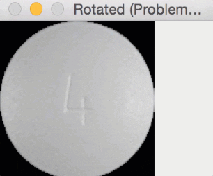
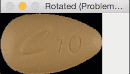
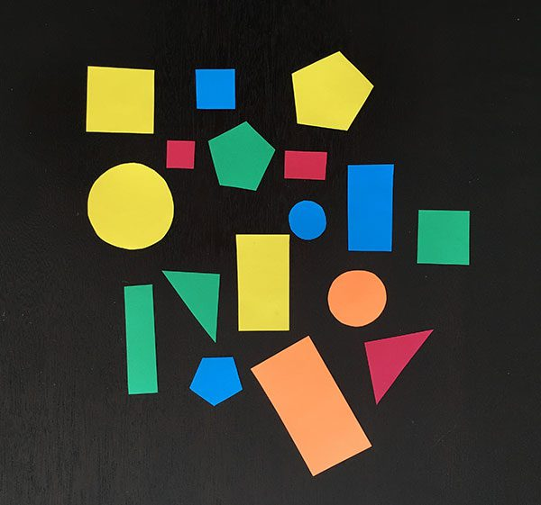
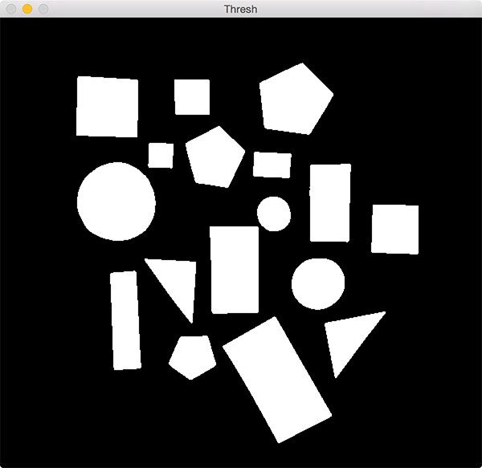
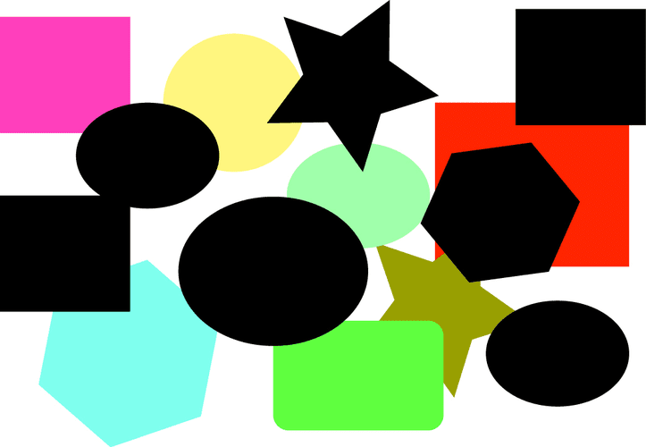
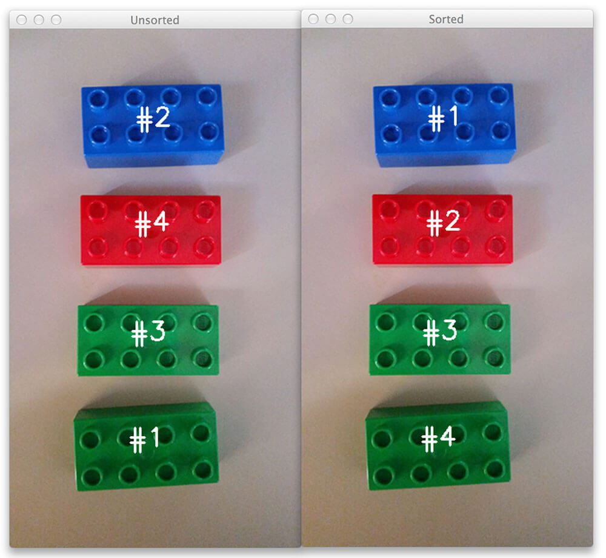

# Build mini project with opencv for beginners

Tutorial from *pyimagesearch*

## Resolving none type errors

Main causes to have `NoneType` error:
+ An invalid path passed to `cv2.imread`
The `cv2.imread` function does not explicitly throw an error message if you give it an invalid file path (i.e., a path to a nonexistent file). Instead, `cv2.imread` will simply return None .
Anytime you try to access an attribute of a None image loaded from disk via cv2.imread you’ll get a NoneType error.

*Note: let’s say you have a .JPEG file on disk and you knew you had the correct path to it. You then try to load the JPEG file via cv2.imread and notice a NoneType or AssertionError.
How can this be? The file exists! In this case, you likely forgot to compile OpenCV with JPEG file support enabled. In Debian/Ubuntu systems, this is caused by a lack of libjpeg being installed. For macOS systems, you likely forgot to install the jpeg library via Homebrew.*
*To resolve this problem, regardless of operating system, you’ll need to re-compile and re-install OpenCV.*

+ A problem reading a frame from a video stream/video file wia cv2.VideoCapture and the associated `.read` method
Working with video streams and video files with OpenCV is more complex than simply loading an image via `cv2.imread`, but the same rules apply. Possible problems are:
    + the path is incorrect
    + not having the proper video codecs installed
    + your webcam not being accessible via OpenCV (missing drivers, incorrect index passed to `VideoCapture`, or camera not attached to your system)


## Rotate images correctly

### Example

Round pills are approximately square in their aspect ratio, the rotation bug is not a problem for them.

But for oblong pills, they would be cut off in the rotation process, like this:


This can have an impact if you are extracting features from the vector image for example.
That's why the size of the output image needs to be adjusted (otherwise, the corners of the images can be cut off).

### Rotate and rotate bound functions

```
python rotate_simple.py --image images/saratoga.jpg
```

So, does this mean that we should always use `rotate_bound` over the `rotate` method?
It depends on your goal / use case.


### Other functions from OpenCV

There is nothing wrong with the `cv2.getRotationMatrix2D` and `cv2.warpAffine` functions that are used to rotate images inside OpenCV.

In reality, these functions give us more freedom than perhaps we are comfortable with (sort of like comparing manual memory management with C versus automatic garbage collection with Java).

The `cv2.getRotationMatrix2D` function doesn’t care if we would like the entire rotated image to kept.
It doesn’t care if the image is cut off.


## Color detection

### Simple detection
```
python detect_color.py --image images/pokemon_games.jpg
```

*Note: We are performing color detection in the RGB color space. But you can easily do this in the HSV or L*a*b* color space as well. You would simply need to adjust your upper and lower limits to the respective color space.*

### Improve color detection accuracy with color correction

Let’s suppose you are given a dataset of 1,000 images and are told to find all “red” objects with RGB values in the range (17, 15, 100) and (50, 56, 200), respectively.

If your entire dataset of images were captured in controlled lighting conditions with the same lighting for each image, then this won’t be a hard task — you can use the hard-coded RGB values mentioned above.

But … let’s say your dataset of images were not captured in controlled lighting conditions. Some were captured using fluorescent lighting, others were taken outside when it was bright and sunny, while others were captured when it was dark and dreary.

**The point here is that lighting conditions have a huge impact on output pixel values.**

**Colors can look very different under varying illumination, and when that happens, your hard-coded lower and upper RGB ranges will fail.**

One potential solution is to use a different color space which does a better job of mimicking how humans perceive color — the HSV and L*a*b* color spaces are good choices here.

An even better alternative would be to use a color correction card. You place a card (like that in Figure below) in the scene containing the objects we’re capturing, and then you post-process all these images by:
1. Detecting the color correction card
2. Determining the color block region
3. Performing histogram matching to transfer the color space from one image to another

In that manner you can help ensure a consistent color across all images, even though they may have been captured under different lighting conditions.

See these tutorials:
+ [Histogram matching with opencv, scikit image and python](https://www.pyimagesearch.com/2021/02/08/histogram-matching-with-opencv-scikit-image-and-python/)
+ [Automatic color correction with opencv and python](https://www.pyimagesearch.com/2021/02/15/automatic-color-correction-with-opencv-and-python/)


## Montages

```
python montage_example.py --images nordstrom_sample --sample 33
```


## Super fast color transfer images

**Method**: just use the mean and standard deviation of the image channels (much faster than histogram based methods)

The algorithm goes like this:

+ **Step 1**: Input a source and a target image. The source image contains the color space that you want your target image to mimic. The sunset image on the left is my source, the middle image is my target, and the image on the right is the color space of the source applied to the target.

+ **Step 2**: Convert both the source and the target image to the L\*a\*b\* color space. The L*a*b* color space models perceptual uniformity, where a small change in an amount of color value should also produce a relatively equal change in color importance. The L\*a\*b\* color space does a substantially better job mimicking how humans interpret color than the standard RGB color space, and as you’ll see, works very well for color transfer.
+ **Step 3**: Split the channels for both the source and target.
+ **Step 4**: Compute the mean and standard deviation of each of the L\*a\*b\* channels for the source and target images.
+ **Step 5**: Subtract the mean of the L\*a\*b\* channels of the target image from target channels.
+ **Step 6**: Scale the target channels by the ratio of the standard deviation of the target divided by the standard deviation of the source, multiplied by the target channels.
+ **Step 7**: Add in the means of the L\*a\*b\* channels for the source.
+ **Step 8**: Clip any values that fall outside the range [0, 255]. (Note: This step is not part of the original paper. It has been added it due to how OpenCV handles color space conversions. If you were to implement this algorithm in a different language/library, you would either have to perform the color space conversion yourself, or understand how the library doing the conversion is working).
+ **Step 9**: Merge the channels back together.
+ **Step 10**: Convert back to the RGB color space from the L\*a\*b\* space.


The `color_transfer` package is an OpenCV and python implementation
```
pip install color_transfer
```

See the Github repository [here](https://github.com/jrosebr1/color_transfer).


## Center of contour

Our goal is this example is
1. detect the outline of each shape in the image
2. computing the center of the contour (centroid)

The initial image is:


To do that, we need to:
1. conversion to grayscale
2. blurring to reduce high frequency noise to make our contour detection process more accurate
3. binarization of the image. Typically edge detection and thresholding are used for this process. Here, we are going to use thresholding.

The output of the previous operations is:


```
python center_of_shape.py --image images/shapes_and_colors.jpg
```


## Finding shapes in images

Given the following image, we want to:
+ recognize only figures with the black background
+ if 2 or more figures overlap, they all should be treated as one object
+ detect and draw contours around each of the black shapes
+ count the number of black shapes



```
python find_shapes.py --image images/finding_shapes_example.png
```


## Finding extreme points in contours

*Objective: Is it possible to find the extreme north, south, east, and west coordinates from a raw contour?*


*Example of application: hand gesture recognition (and then the number of fingers we are holding up)*


```
python extreme_points.py
```


## Sorting contours



This tutorial allows you to be able to:
+ sort contours according to their size/area, along with a template to follow to sort contours by any other arbitrary criteria
+ sort contoured regions from left to rights, right to left, top to bottom, and bottom to top using a single function

```
python sorting_contours.py --image images\legos_example3.png --method "left-to-right"
```


## Shape detection

In this example, we are going to leverage contour properties to actually label and identify shapes in an image.

In order to perform shape detection, we will be using contour approximation. As the name suggests, contour approximation is an algorithm for reducing the number of points in a curve with a reduced set of points. Contour approximation is predicated on the assumption that a curve can be approximated by a series of short line segments. This leads to a resulting approximated curve that consists of a subset of points that were defined by the original curve.

Contour approximation is actually already implemented in OpenCV via the `cv2.approxPolyDP` method.

**It is important to understand that a contour consists of a list of vertices.**

```
python detect_shapes.py --image images\shapes_and_colors.jpg
```

Note: there are more advanced shape detection techniques. These methods utilize feature extraction/image descriptors and are used to quantify the shape in an image using a list of numbers. One of the most famous is the classic *Hu moments shape descriptor* (`cv2.HuMoments`) ; there is also *Zernike moments*, based on Hu moments but more powerful (25 numbers used to quantify the shape instead of 7), but may require some manual parameter tuning. Finally, you can also use deep learning.


## Determine object color

Regions of an image can be characterized by both color histograms and by basic color channel statistics such as mean and standard deviation.
But while we can compute these various statistics, they cannot give us yet an actual label such as "red", "green", "blue", or "black" that tags a region as containing a specific color.

**Why are we using the L\*a\*b\* color space rather than RGB or HSV?**
We are computing the euclidian distance between our dataset of known colors and the averages of a particular image region. The known color that minimizes the euclidian distance will be chosen as the color identification. And unlike HSV and RGB color spaces, the euclidian distance between L\*a\*b\* colors has actual perceptual meaning.

```
python detect_color_improvements.py --image images\shapes_and_colors.jpg
```

The main **limitations** in our example is that due to lighting conditions, along with various hues and saturations, colors rarely look like pure red, green, blue, etc. You can often identify small sets of colors using the L*a*b* color space and the Euclidean distance, but for larger color palettes, this method will likely return incorrect results depending on the complexity of your images.
